# Finetuned-Medical-Multimodal-RAG

A detailed guide to the codebase powering a **Question Answering** and **Visual Question Answering** system using deep learning, retrieval augmented generation, and feedback-driven retraining.

---

## Index

1. [Project Overview](#project-overview)
2. [File Structure](#file-structure)
3. [Architecture Diagram](#architecture-diagram)
4. [data.py](#datapy)
   - Data Loading
   - Tokenization
   - Image Dataset & Index
5. [models.py](#modelspy)
   - Model Initialization
   - Reloading Models
6. [utils.py](#utilspy)
   - Retrieval Functions
   - Evaluation Metrics
   - RAG Pipelines
   - Feedback & Retraining
7. [app.py](#apppy)
   - Flask API Endpoints
   - Workflow Sequence
8. [Entity Relationship Diagram: Datasets & Models](#entity-relationship-diagram)
9. [API Request Sequence](#api-request-sequence)
10. [Appendix: Key Dependencies](#appendix-key-dependencies)

---

## Project Overview

This application enables users to:

- Ask clinical questions and get answers from a finetuned GPT-2 model, augmented with retrieval from the MedQuad dataset (RAG).
- Upload medical images and get VQA answers using BLIP, augmented with retrieval from VQA-RAD.
- Evaluate model responses against references using multiple metrics.
- Submit feedback/corrections, enabling continual dataset growth and on-demand model retraining.

---

## File Structure

| File/Folder          | Purpose                                                                                      |
|----------------------|----------------------------------------------------------------------------------------------|
| `data.py`            | Data loading, preprocessing, tokenization, and FAISS index loading for text/image retrieval. |
| `models.py`          | Initialization and management of GPT-2 and BLIP models and tokenizers.                       |
| `utils.py`           | Core utility functions: retrieval, RAG, evaluation, feedback storage, and retraining.        |
| `app.py`             | Flask web API: defines all endpoints, request routing, and user interactions.                |
| `templates/`         | Contains HTML templates for web UI.                                                          |
| `templates/index(1).html` | Main homepage template rendered by the Flask app.                                       |

**Note:**  
The `templates` folder contains the main HTML UI for the application, specifically the file `index(1).html`, which is rendered for the root (home) page of the web interface.

---

## Architecture Diagram

```mermaid
flowchart TD
    subgraph User
        U1["🧑‍⚕️ Web Client (Browser)"]
    end
    subgraph FlaskApp
        A1["app.py (Flask API)"]
        U2["utils.py (Retrieval, RAG, Eval, Feedback)"]
        D1["data.py (Dataset/Index Loader)"]
        M1["models.py (GPT2/BLIP Init)"]
        T1["templates/index(1).html"]
    end
    subgraph Datasets
        DS1["medquad_cleaned_small.jsonl"]
        DS2["vqa_rad_open_ended.json"]
        DS3["faiss_image_vqarad.index"]
        DS4["medquad_embedder_small.index"]
    end
    U1 -- "POST /query, /caption, /feedback, /retrain" --> A1
    U1 -- "GET /" --> A1
    A1 -- renders --> T1
    A1 -- calls --> U2
    U2 -- loads/uses --> M1
    U2 -- loads --> D1
    D1 -- loads --> DS1
    D1 -- loads --> DS2
    D1 -- loads --> DS3
    U2 -- uses --> DS4
```



---

## data.py

**Purpose**:  
Handles loading of datasets used for text QA and VQA, tokenization, and FAISS index loading for efficient retrieval.

### Main Components

| Function/Var                | Description                                                           |
|-----------------------------|-----------------------------------------------------------------------|
| `df`                        | Loads MedQuad QA dataset as HuggingFace Dataset.                      |
| `corpus`                    | List of answers for TF-IDF vectorizer corpus.                         |
| `vectorizer`                | TF-IDF vectorizer fitted on the answer corpus.                        |
| `tokenize_function`         | Converts QA pairs into input format for GPT-2 tokenization.           |
| `load_vqarad_open_ended()`  | Loads the VQA-RAD open-ended Q&A dataset, extracts images/Q&A.        |
| `image_paths, vqarad_questions, vqarad_answers` | Arrays of images/questions/answers from VQA-RAD.       |
| `faiss_index`               | Loads pre-built FAISS index for image embedding retrieval.            |

#### Loading QA Dataset

```python
df = load_dataset('json', data_files='medquad_cleaned_small.jsonl', split='train')
corpus = df["answer"]
vectorizer = TfidfVectorizer()
vectorizer.fit(corpus)
```

#### Tokenization for GPT-2

```python
def tokenize_function(examples):
    from models import gpt2_tokenizer
    texts = [f"Question: {q}\nAnswer: {a}" for q, a in zip(examples["question"], examples["answer"])]
    return gpt2_tokenizer(
        texts, padding="max_length", truncation=True, max_length=512,
    )
```

#### VQA-RAD Dataset Loading

```python
def load_vqarad_open_ended():
    with open("vqa-rad/vqa_rad_open_ended.json", "r", encoding="utf-8") as f:
        data = json.load(f)
    # Extract image paths, questions, and answers
    ...
image_paths, vqarad_questions, vqarad_answers = load_vqarad_open_ended()
```

#### FAISS Image Index

```python
faiss_index = faiss.read_index("faiss_image_vqarad.index")
```

---

## models.py

**Purpose**:  
Initializes and loads all models and tokenizers required: GPT-2 for text QA and BLIP for VQA, as well as a sentence transformer for embedding-based retrieval.

### Main Components

| Variable           | Description                                               |
|--------------------|----------------------------------------------------------|
| `device`           | Uses CUDA if available, else CPU.                        |
| `gpt2_model`       | GPT-2 model (finetuned) for text QA.                     |
| `gpt2_tokenizer`   | Tokenizer for GPT-2.                                     |
| `blip_model`       | BLIP VQA model (finetuned) for visual QA.                |
| `blip_processor`   | Processor for BLIP (tokenization + image preprocessing). |
| `embedder`         | SentenceTransformer for text embedding retrieval.         |

#### Model Initialization

```python
gpt2_model = GPT2LMHeadModel.from_pretrained(gpt2_model_path).to(device)
gpt2_tokenizer = GPT2Tokenizer.from_pretrained(gpt2_model_path)
blip_model = BlipForQuestionAnswering.from_pretrained(blip_model_path).to(device)
blip_processor = BlipProcessor.from_pretrained(blip_model_path, use_fast=True)
embedder = SentenceTransformer('all-mpnet-base-v2')
```

#### Model Reloading

```python
def reload_gpt2_model():
    global gpt2_model, gpt2_tokenizer
    gpt2_model = GPT2LMHeadModel.from_pretrained(gpt2_model_path).to(device)
    gpt2_tokenizer = GPT2Tokenizer.from_pretrained(gpt2_model_path)
    gpt2_tokenizer.pad_token = gpt2_tokenizer.eos_token
```

---

## utils.py

**Purpose**:  
Contains the core logic for retrieval-augmented generation, similarity/evaluation metrics, feedback/correction logging, and retraining routines.

### Main Components

#### Retrieval Functions

| Function       | Description                                                                   |
|----------------|-------------------------------------------------------------------------------|
| `retrieve()`   | Retrieves top-k answers from MedQuad using dense sentence embeddings & FAISS. |
| `retrieve_image()` | Retrieves top-k VQA answers by searching image embedding FAISS index.     |

#### Retrieval Example

```python
def retrieve(query, top_k=3):
    answers = df["answer"]
    query_embed = embedder.encode(query)
    query_vec = np.array([query_embed]).astype(np.float32)
    _, I = index_text.search(query_vec, top_k)
    return [answers[i] for i in I[0]]
```

#### RAG Pipeline

| Function      | Description                                                                                        |
|---------------|----------------------------------------------------------------------------------------------------|
| `rag()`       | Retrieves similar answers, builds prompt, generates answer with GPT-2.                             |
| `rag_image()` | Retrieves similar image answers, builds prompt, generates answer with BLIP.                        |

#### RAG Logic

```python
def rag(query, dataset, max_context_length=300):
    retrieved_docs = retrieve(query)
    context = " ".join(retrieved_docs)[:max_context_length]
    reference_answer = choose_expected_response(query, dataset)
    ...
    outputs = gpt2_model.generate(inputs['input_ids'], ...)
    ...
    return answer, reference_answer
```

#### Evaluation Metrics

| Function               | Description                                         |
|------------------------|-----------------------------------------------------|
| `comparison_evaluator()` | Calculates Levenshtein similarity, cosine, BERTScore, etc. |

#### Feedback & Retraining

| Function            | Description                                           |
|---------------------|-------------------------------------------------------|
| `save_feedback_gpt2()` | Appends user corrections to MedQuad JSONL.         |
| `save_feedback_blip()` | Appends user caption corrections to test CSV.      |
| `retrain_gpt2()`    | Loads new data, shuffles, and retrains GPT-2 with LoRA.|

---

## app.py

**Purpose**:  
Defines all web endpoints and orchestrates data flow between user input, retrieval/generation functions, evaluation, feedback, and retraining.

### API Endpoints

| Route          | Method | Description                                                                              |
|----------------|--------|------------------------------------------------------------------------------------------|
| `/`            | GET    | Web UI homepage (renders HTML template).                                                 |
| `/query`       | POST   | Accepts user question, returns generated and reference answers + evaluation metrics.      |
| `/caption`     | POST   | Accepts medical image & question, returns VQA answer + reference + evaluation metrics.   |
| `/feedback`    | POST   | Records user corrections for QA or VQA.                                                  |
| `/retrain`     | POST   | Triggers retraining of the GPT-2 model.                                                  |

#### Templates Folder

The Flask application specifies its template directory as `templates`, and serves the homepage using `index(1).html`:

```python
app = Flask(__name__, template_folder='templates')
...
@app.route('/')
def home():
    return render_template('index(1).html')
```

Therefore, you must include a folder named `templates` in your project root, and within it, an HTML file named `index(1).html`. This file constitutes the main UI for the web interface.

#### Example: QA Request/Response Sequence

```python
@app.route('/query', methods=['POST'])
def query():
    data = request.json
    query_text = data.get('query')
    generated_answer, reference_answer = rag(query_text, df)
    lev_similarity, cos_sim, precision, recall, f1_score = comparison_evaluator(generated_answer, reference_answer)
    return jsonify({
        'generated_answer': generated_answer,
        'reference_answer': reference_answer,
        'lev_similarity': float(lev_similarity),
        'cosine_similarity': float(cos_sim),
        'precision': float(precision),
        'recall': float(recall),
        'f1_score': float(f1_score),
        'question': query_text
    })
```

#### Error Handling

- Returns JSON error messages for missing fields or failed operations.
- Logs errors for debugging.

---

## Entity Relationship Diagram

A schema showing the relationships between major datasets, models, and indices:


---

## API Request Sequence

A sequence diagram for the `/query` endpoint (text QA):


---

## Appendix: Key Dependencies

- **Flask**: Web server for API endpoints.
- **transformers**: HuggingFace models (GPT-2, BLIP).
- **sentence-transformers**: Sentence embeddings for retrieval.
- **FAISS**: Fast Approximate Nearest Neighbor Search for retrieval.
- **scikit-learn**: TF-IDF, cosine similarity, metrics.
- **Pillow**: Image processing.
- **datasets**: Dataset loading and management.
- **bert-score, Levenshtein**: Text similarity metrics.

---

## Summary

This system combines the power of retrieval-augmented generation (RAG) with continual feedback and retraining to deliver robust medical Q&A and VQA capabilities. It leverages dense embedding search, state-of-the-art language and vision models, and a modern web API for easy interaction.

---

Requirements:
1. GPT-2 Fine-Tuned on MedQuAD
This is a domain-adapted GPT-2 model fine-tuned using the MedQuAD dataset for medical question-answering.
🔗 Download from Hugging Face: https://huggingface.co/sarnsrun/gpt2-medquad-finetuned

2. BLIP-VQA Fine-Tuned on VQA-RAD
This is a BLIP model fine-tuned on the VQA-RAD dataset for visual question answering in the medical domain.
🔗 Download from Hugging Face: https://huggingface.co/sarnsrun/blip-vqa-finetuned

3. VQA-RAD Dataset
A processed version of the VQA-RAD dataset, containing only open-ended questions.
🔗 Download: https://huggingface.co/datasets/sarnsrun/vqa-rad

4. ROCO Dataset
Obtained from: https://github.com/razorx89/roco-dataset/tree/master/data

References:

Ben Abacha, A., & Demner-Fushman, D. (2019). A question-entailment approach to question answering. BMC Bioinformatics, 20(1), 511. https://doi.org/10.1186/s12859-019-3119-4

Lau, J. J., Gayen, S., Demner-Fushman, D., & Ben Abacha, A. (2018). VQA-RAD: A dataset of clinically generated visual questions and answers about radiology images. OSF. https://doi.org/10.17605/OSF.IO/89KPS

O. Pelka, S. Koitka, J. Rückert, F. Nensa, C.M. Friedrich,
"Radiology Objects in COntext (ROCO): A Multimodal Image Dataset".
MICCAI Workshop on Large-scale Annotation of Biomedical Data and Expert Label Synthesis (LABELS) 2018, September 16, 2018, Granada, Spain. Lecture Notes on Computer Science (LNCS), vol. 11043, pp. 180-189, Springer Cham, 2018.
doi: 10.1007/978-3-030-01364-6_20
